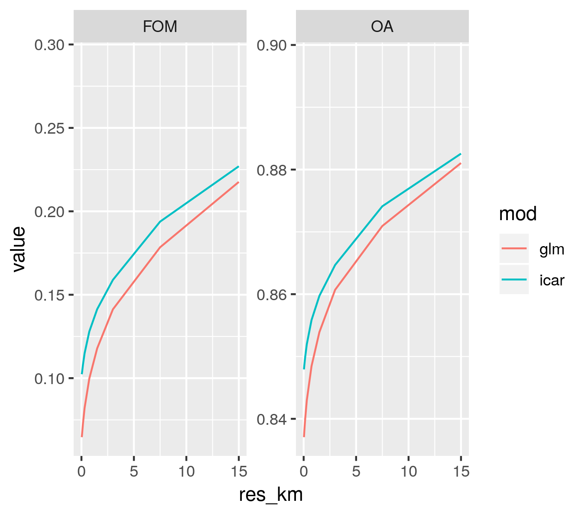

# Figures

(ref:cap-accuracy) **Models' accuracy at multiple resolutions**. We compared the projected deforestation maps of the two models (glm and icar) to the observed deforestation map on the period 2010-2017 [@Vieilledent2018data; @Vieilledent2018]. We computed the Figure Of Merit (FOM) and the Overall Accuracy (OA) of the projections at multiple resolutions (from 30 m to 15 km).

```{r accuracy, out.width="\\textwidth", fig.cap="(ref:cap-accuracy)"}

```

\newpage