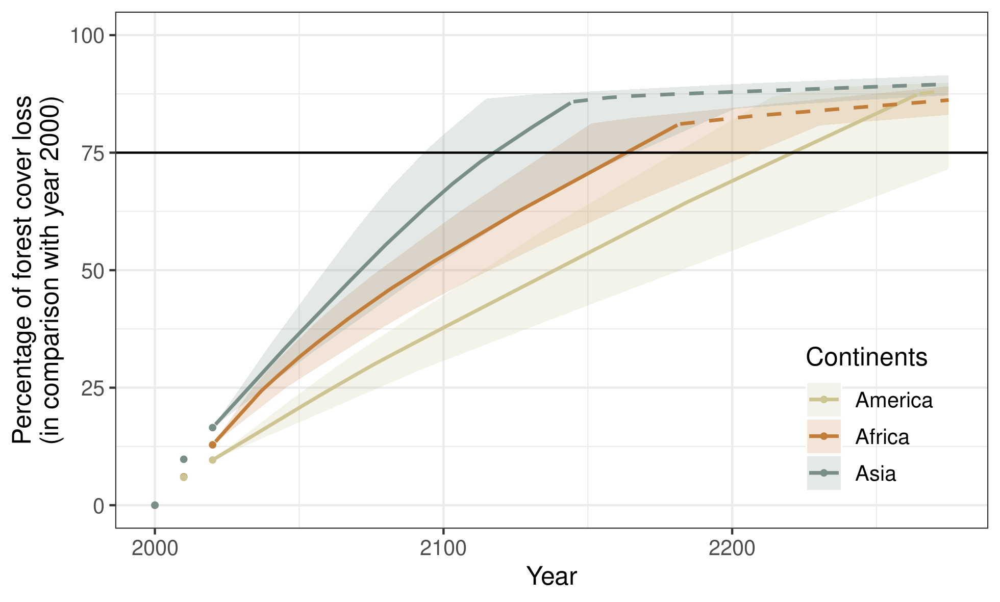

# Figures {-}

<!----------------------------------->
<!-- Projected forest cover change -->
<!----------------------------------->

(ref:cap-fcc2100) **Pantropical map of the predicted change in forest cover**. Maps show the predicted change in tropical moist forest cover in the three continents (America, Africa, and Asia) for the period 2020--2100 under a business-as-usual scenario of deforestation. The horizontal black line represents the Equator. The  boundaries of the study area are represented by dark gray lines. Forest areas in \textcolor{red}{red} are predicted to be deforested in the period 2020--2100, while forest areas in \textcolor{darkgreen}{green} are likely to still exist in 2100. Several countries on the three continents are expected to lose all their tropical moist forest by 2100 (including Nicaragua and Mexico in Central America, Madagascar and Ghana in Africa, and Laos and Vietnam in Asia). We predict progressive fragmentation of the remaining forest in the future, with an increasing number of isolated forest patches of smaller size (e.g. Pará state in Brazil, the Democratic Republic of the Congo, and Indonesia). These maps make it possible to identify both future hotspots of deforestation and forest refuge areas (e.g. concentrated in the heart of the Amazon, West Central Africa, and Papua New Guinea). An interactive map is available at <https://forestatrisk.cirad.fr/maps.html>, and a zoom of this map for the DRC is available in Supplementary Materials.

```{r fcc2100, out.width="\\textwidth", fig.cap="(ref:cap-fcc2100)"}
knitr::include_graphics("figures/fcc2100.png")
```

<!--------------------------------------------->
<!-- Percentage of forest cover loss -->
<!--------------------------------------------->

(ref:cap-perc-loss) **Projected percentage of forest cover loss per continent**. Points represent the observed percentage of forest cover loss (in comparison with the year 2000) for the years 2000 (0%), 2010, and 2020, for the three continents: America, Africa, and Asia. Lines represent the projected percentage of forest cover loss (in comparison with the year 2000) from year 2020 to 2400 per continent. For the deforestation projections, we assumed no diffusion of the deforestation between countries. When large countries with high annual deforested areas (Brazil for America, DRC for Africa, and Indonesia for Asia) have nor more forest (in 2237, 2156, and 2115, respectively, see table S16), deforestation at the continent scale is rapidly decreasing. The horizontal black line indicates a loss of 75% of the forest cover in comparison with the year 2000. Under a "business-as-usual" scenario, this should happen in 2094, 2143, and 2197 for Asia, Africa, and America, respectively. The confidence envelopes around the mean are obtained using the lower and upper limits of the confidence intervals of the mean annual deforested areas for all study areas.

```{r perc-loss, out.width="\\textwidth", fig.cap="(ref:cap-perc-loss)"}

```

<!----------------------------------------------------------------->
<!-- Pantropical map of the spatial probability of deforestation -->
<!----------------------------------------------------------------->

(ref:cap-prob) **Pantropical map of the risk of deforestation**. _Upper panels_: Maps of the spatial probability of deforestation at 30 m resolution for the three continents. Maps of the spatial probability of deforestation at the level of the study area were aggregated at the pantropical level. The horizontal black line represents the Equator. The boundaries of the study area are represented by dark gray lines. Colored pixels represent forest pixels for the year 2020. Inside each study area, forest areas in dark red have a higher risk of deforestation than forest areas in green. _Lower panels_: Detailed maps for three 100 $\times$ 100 km regions (black squares in the upper panels) in the Matto Grosso state (Brazil), the Albertine Rift mountains (the Democratic Republic of the Congo), and the West Kalimantan region (Borneo Indonesian part). Deforestation probability is lower inside protected areas (black shaded polygons) and increases when the forest is located at a distance closer to roads (dark grey lines) and forest edge. An interactive map of the spatial probability of deforestation is available at <https://forestatrisk.cirad.fr/maps.html>.

```{r prob, out.width="\\textwidth", fig.cap="(ref:cap-prob)"}
knitr::include_graphics("figures/prob_zoom.png")
```

<!-------------------------------------------------------------->
<!-- Carbon emissions associated with projected deforestation -->
<!-------------------------------------------------------------->

```{r}
dataset <- "jrc2020"
f <- here("Analysis", dataset, "C_trend_mean.csv")
C_trend <- read.table(f, header=TRUE, sep=",")
C_10_20 <- round(C_trend$T10_20[C_trend$area_cont=="All continents"], 3)
C_all <- C_trend[C_trend$area_cont=="All continents",-c(1)]
C_max <- round(max(C_all), 3)
```

(ref:cap-cem) **Aboveground carbon emissions associated with projected deforestation**. This figure shows the changes in annual carbon emissions (Pg/yr) associated with the predicted deforestation of moist tropical forests. Mean annual carbon emissions are computed for ten-year intervals from 2010--2020 to 2090--2100. The dots represent the observed mean annual carbon emissions (based on past deforestation maps) for the period 2010--2020, for the three continents (America, Africa, and Asia), and for the three continents combined. Lines represent the projected mean annual carbon emissions based on projected forest cover change maps from 2020--2030 to 2090--2100 per continent, and for all continents together. The confidence envelopes around the mean are obtained using the lower and upper limits of the confidence intervals of the mean annual deforested areas for all study areas. Annual carbon emissions at the pantropical scale are predicted to increase from `r C_10_20` Pg/yr in 2010--2020 to `r C_max` Pg/yr in 2070--2080, representing a 42% increase (+0.221 Pg/yr). 

```{r c-em, out.width="\\textwidth", fig.cap="(ref:cap-cem)"}
knitr::include_graphics("figures/C_trend.png")
```

<!-------------------------------------------------------------------------------------->
<!-- Effects of explanatory variables on the spatial probability of deforestation -->
<!-------------------------------------------------------------------------------------->

(ref:cap-proba-var) **Effects of protected areas, roads, and distance to forest edge on the spatial probability of deforestation**. In this figure, we use a representative dataset at the global scale where the number of observations for each study area is proportional to its forest cover in 2010. We used a total of 813,796 observations sampled in the original dataset (table S3). _Left_: The dots represent the observed mean probability of deforestation in each forest protection class, either protected or unprotected. Bars represent the mean of the predicted probabilities of deforestation obtained from the deforestation model for all observations in each class. _Right_: The dots represent the local mean probability of deforestation for each bin of 10 percentiles for the distance. Lines represent the mean of the predicted probabilities of deforestation obtained from the deforestation model for all observations in each bin. (Note that for distance to forest edge, the first dot accounts for three bins while for distance to road, bins for a distance > 23 km are not shown).

```{r proba-var, out.width="\\textwidth", fig.cap="(ref:cap-proba-var)"}
knitr::include_graphics("figures/proba-var.png")
```

\newpage
