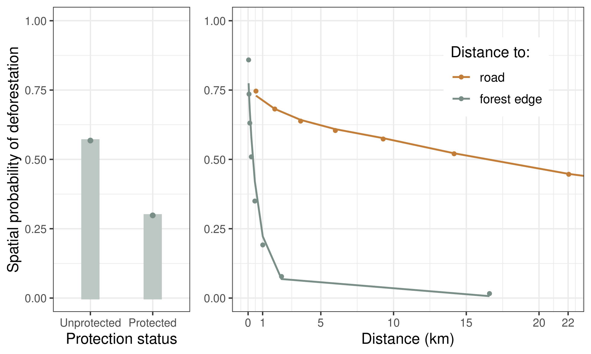
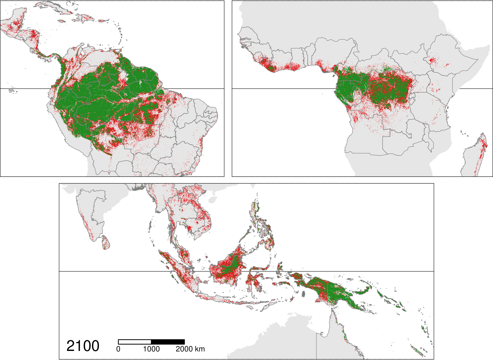

# Figures {-}

<!-------------------------------------------------------------------------------------->
<!-- Effects of explanatory variables on the spatial probability of deforestation -->
<!-------------------------------------------------------------------------------------->

(ref:cap-probavar) **Effects of explanatory variables on the spatial probability of deforestation**. For this figure, we used a representative data-set at the global scale where the number of observations for each study-area was proportional to its forest cover in 2010. The total number of observations changed from 3,186,698 to 813,796. _Left_: Points represent the observed mean probability of deforestation in each class of forest's protection status, either protected or unprotected. Bars represent the mean of the predicted probabilities of deforestation obtained from the iCAR deforestation model for all observations in each class. _Right_: Points represent the local mean probability of deforestation for each bins of 10 percentiles for the distances. For distance to forest edge, the first point account for 3 bins. For distance to road, bins corresponding to a distance > 23 km  are not shown. Lines represent the mean of the predicted probabilities of deforestation obtained from the iCAR deforestation model for all observations in each bin.   

```{r proba-var, out.width="\\textwidth", fig.cap="(ref:cap-probavar)"}

```

<!----------------------------------------------------------------->
<!-- Pantropical map of the spatial probability of deforestation -->
<!----------------------------------------------------------------->

(ref:cap-prob) **Pantropical map of the spatial probability of deforestation**. Pantropical map of the spatial probability of deforestation computed for each tropical moist forest 30 m resolution pixel in 2020. Maps of the spatial probability of deforestation obtained at the study-area level were aggregated at the pantropical level. The horizontal black line indicates the position of the Equator. The boundaries of the study-areas are represented by dark gray lines. Inside each study-area, forest areas in dark red have a higher risk of deforestation than forest areas in green. At this scale, the effect of the distance to forest edge, and the effect of the distance to nearest river (see Amazon and Congo rivers) on the spatial probability of deforestation are well visible. An interactive map is available at <https://forestatrisk.cirad.fr/tropics> and a zoom of this map for the Democratic Republic of the Congo is available in the Supplementary Materials. The effects of the other environmental explanatory variables on the spatial probability of deforestation are well visible on these maps.

```{r prob, out.width="\\textwidth", fig.cap="(ref:cap-prob)"}
knitr::include_graphics("figures/prob.png")
```

<!----------------------------------->
<!-- Projected forest cover change -->
<!----------------------------------->

(ref:cap-fcc2100) **Projected pantropical forest cover change map**. Pantropical map of the projected tropical moist forest cover change for the period 2020--2100 under a "business-as-usual" scenario of deforestation. The horizontal black line indicates the position of the Equator. The boundaries of the study areas-are represented by dark gray lines. Forest areas in \textcolor{red}{red} are predicted to be deforested in the period 2020--2100, while forest areas in \textcolor{darkgreen}{green} are likely to remain in 2100. Several countries in the three continents should experience a complete loss of their tropical moist forest by 2100 (among which Nicaragua and Mexico in America, Madagascar and Ghana in Africa, and Laos and Vietnam in Asia). We predict a progressive fragmentation of the remaining forest in the future, with an increasing number of isolated forest patches of smaller size (e.g. Pará state in Brazil, Democratic Republic of the Congo, and Indonesia). The maps allows identifying both future likely hotspots of deforestation and forest refuge areas (e.g. concentrated in the heart of the Amazon, West Central Africa, and Papua New Guinea). An interactive map is available at <https://forestatrisk.cirad.fr/tropics> and a zoom of this map for the DRC is available in the Supplementary Materials.

```{r fcc2100, out.width="\\textwidth", fig.cap="(ref:cap-fcc2100)"}

```

<!-------------------------------------------------------------->
<!-- Carbon emissions associated with projected deforestation -->
<!-------------------------------------------------------------->

```{r}
dataset <- "jrc2020"
f <- here("Analysis", dataset, "C_trend_mean.csv")
C_trend <- read.table(f, header=TRUE, sep=",")
C_10_20 <- round(C_trend$T10_20[C_trend$area_cont=="All continents"], 2)
C_all <- C_trend[C_trend$area_cont=="All continents",-c(1)]
C_max <- round(max(C_all), 2)
```

(ref:cap-cem) **Carbon emissions associated with projected deforestation**. This figure displays the future change in annual carbon emissions (Pg/yr) associated with projected deforestation of moist tropical forests. Mean annual carbon emissions were computed for ten-year intervals from 2010--2020 to 2090--2100. Points represent the observed mean annual carbon emissions (based on historical deforestation maps) for the period 2010--2020, for the three continents (America, Africa, and Asia), and for all continents together. Lines represent the projected mean annual carbon emissions (based on projected forest cover change maps) from 2020--2030 to 2090--2100 per continent, and for all continents together. Annual carbon emissions at the pantropical scale are predicted to increase from `r C_10_20` in 2010--2020 up to `r C_max` Pg/yr in 2080--2090.  

```{r c-em, out.width="\\textwidth", fig.cap="(ref:cap-cem)"}
knitr::include_graphics("figures/C_trend.png")
```

\newpage
