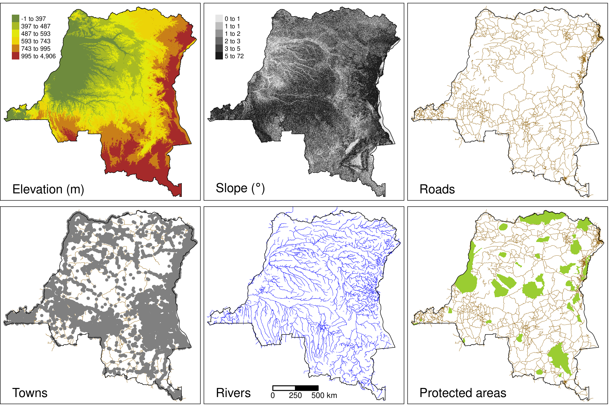
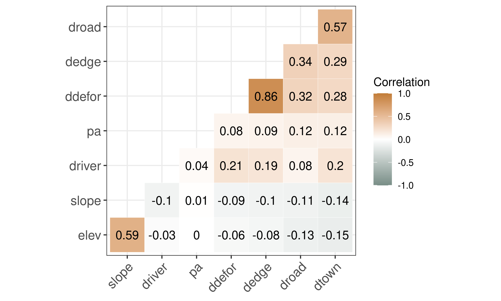
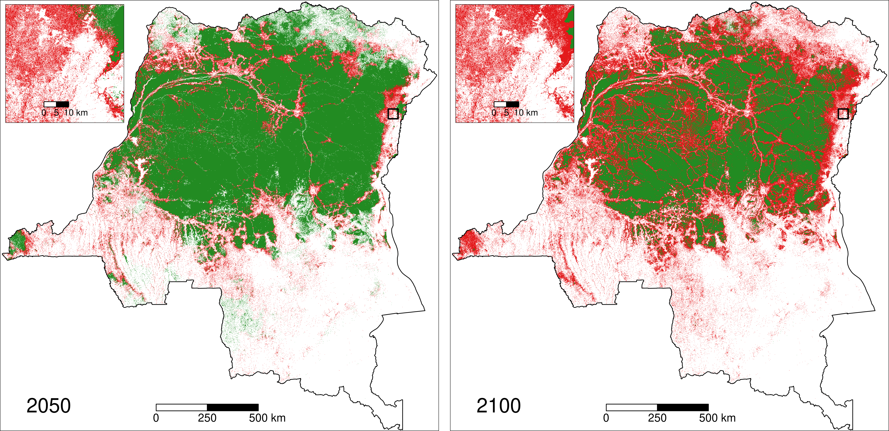
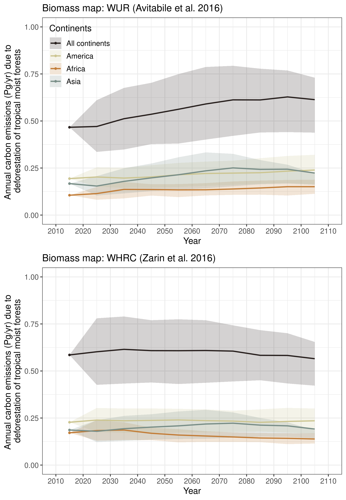
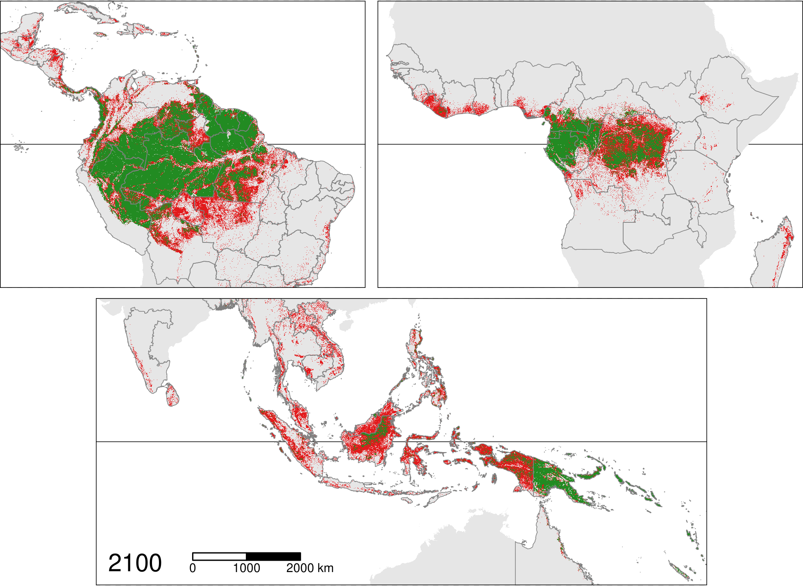

# Supplementary figures

<!--------------------------------------------->
<!-- study areas -->
<!--------------------------------------------->

## Fig. S1 -- Study areas in the three continents {-}

(ref:cap-study-areas) **Study areas in the three continents: America, Africa, and Asia**. America included 64 study areas (39 countries), Africa included 32 study areas (32 countries), and Asia included 23 study areas (21 countries). Each country was identified by one unique three-letter code following the ISO 3166-1 standard (eg. MDG for Madagascar or GUF for French Guiana). In America, Brazil was divided in 26 study areas corresponding to the 26 Brazilian states. Each Brazilian state was defined by one unique two-letter code (eg. AM for Amazonas). For India, three study areas were considered: the Whestern Ghats (WG), the North-East India (NE), and the Andaman and Nicobar Islands (AN). For Australia, we only considered the Queensland (QLD) state as a study area. In the three figures, each study area is identified by one unique code and a set of polygons with the same colour. The horizontal lines on each figure indicate the position of the Equator (plain line) and the two tropics (Cancer at the North and Capricorn at the South, dashed lines).

```{r study-areas-am, out.width="\\textwidth", fig.cap=NULL}

```

```{r study-areas-af, out.width="\\textwidth", fig.cap=NULL}

```

```{r study-areas, out.width="\\textwidth", fig.cap="(ref:cap-study-areas)"}
knitr::include_graphics("figures/study_areas_Asia.png")
```

<!--------------------------------------------->
<!-- Past forest cover change map -->
<!--------------------------------------------->

## Fig. S2 -- Past forest cover change map {-}

(ref:cap-fcc-maps) **Past forest cover change map**. Map of forest cover change for the period 2000--2010--2020 for the Democratic Republic of the Congo in central Africa (bottom-left inset). \textcolor{orange}{orange}: 2000--2010 deforestation, \textcolor{red}{red}: 2010--2020 deforestation, \textcolor{darkgreen}{green}: forest cover in 2020. Forest cover change map was derived from the forest cover change annual product by @Vancutsem2021. Original resolution of the forest cover change map is 30 m. The top-left inset shows a zoom of the map for an area at the North-East of the country which is close to the city of Beni and the Virunga national park. An interactive pantropical forest cover change map is available at <https://forestatrisk.cirad.fr/maps.html>.

```{r fcc-maps, out.width="\\textwidth", fig.cap="(ref:cap-fcc-maps)"}
knitr::include_graphics("figures/fcc123.png")
```

<!--------------------------------------------->
<!-- Spatial explanatory variables -->
<!--------------------------------------------->

## Figs. S3--S6 -- Spatial explanatory variables used for modelling deforestation {-}

(ref:cap-var) **Spatial explanatory variables**. Spatial explanatory variables for the Democratic Republic of the Congo in central Africa. Elevation (in m) and slope (in degree) at 90 m resolution were obtained from the SRTM Digital Elevation Database v4.1 (<http://srtm.csi.cgiar.org/>). Distances (in m) to nearest road, town, and river at 150 m resolution were computed from the road, town, and river network obtained from OpenStreetMap (OSM) (<https://www.openstreetmap.org/>). Roads include "motorway", "trunk", "primary", "secondary" and "tertiary" roads from OSM. Towns include "city", "town" and "village"  categories from OSM. Rivers include "river" and "canal" categories from OSM. Protected areas were obtained from the World Database on Protected Areas (<https://www.protectedplanet.net> , @WDPA2020). We retained protected areas defined by at least one polygon and which had the following status: "Designated", "Inscribed", "Established", or "Proposed" before January 1^st^ 2010. Data included protected areas of all IUCN categories (from Ia to VI) and of all types defined at the national level (e.g. National Parks, Reserves). Two additional spatial explanatory variables (distance to forest edge and distance to past deforestation) were obtained from the past forest cover change map (Fig. \@ref(fig:fcc-maps)).

```{r var, out.width="\\textwidth", fig.cap="(ref:cap-var)"}

```

(ref:cap-data-roads) **Pantropical road network**. The road network was obtained from OpenStreetMap (OSM) (<https://www.openstreetmap.org/>). Roads included "motorway", "trunk", "primary", "secondary" and "tertiary" roads from OSM. Our dataset included a total of 3,606,841 roads.

```{r data-roads, out.width="\\textwidth", fig.cap="(ref:cap-data-roads)"}

```

(ref:cap-data-pa) **Pantropical data-set on protected areas**. Terrestrial protected areas in \textcolor[HTML]{5c7b1e}{green}, marine protected areas in \textcolor[HTML]{51677e}{blue}. Protected areas were downloaded from the World Database on Protected Areas (<https://www.protectedplanet.net>, @WDPA2020) using the `pywdpa` Python package. We retained protected areas defined by at least one polygon and which had the following status: "Designated", "Inscribed", "Established", or "Proposed" before January 1^st^ 2010. Data included protected areas of all IUCN categories (from Ia to VI) and of all types defined at the national level (e.g. National Parks, Reserves). Our dataset included a total of 89,855 protected areas.

```{r data-pa, out.width="\\textwidth", fig.cap="(ref:cap-data-pa)"}

```

(ref:cap-corr-var) **Correlation between explanatory variables**. To compute the correlations, we used a representative data-set at the global scale where the number of observations for each study area was proportional to its forest cover in 2010. We used a total of 798,859 observations. We computed the Pearson's correlation matrix for the seven continuous explanatory variables used to model the deforestation: elevation ("elev"), slope ("slope"), distance to nearest road, town, and river ("droad", "dtown", and "driver", respectively), distance to forest edge ("dedge"), and distance to past deforestation ("ddefor"). For the protected areas ("pa"), which is a categorical variable for which a Pearson's correlation coefficient cannot be computed, we reported the slope coefficient of simple logistic regressions where the probability of presence of a protected area was a function of one intercept and one of the continuous variable (which was normalized).

```{r corr-var, out.width="\\textwidth", fig.cap="(ref:cap-corr-var)"}

```

<!--------------------------------------------->
<!-- Data sampling -->
<!--------------------------------------------->

## Fig. S7 -- Data sampling {-}

(ref:cap-sampling) **Data sampling for spatial modelling of deforestation**. Map on the left corresponds to the top left inset in Fig. \@ref(fig:fcc-maps) representing a zoom of the forest cover change map in the period 2000--2010--2020 for an area at the North-East of the Democratic Republic of the Congo. Map on the right presents an inner zoom showing the delimitation of the 30 m forest pixels with two sample points. We used a stratified balanced sampling between (i) forest pixels in 2010 which have been deforested in the period 2010--2020 ("deforested" pixels in \textcolor{red}{red}), and (ii) forest pixels in 2010 which have not been deforested in that period of time and which represent the remaining forest in 2020 ("non-deforested" pixels in \textcolor{darkgreen}{green}). Forest pixels in each category were sampled randomly.

```{r sampling, out.width="\\textwidth", fig.cap="(ref:cap-sampling)"}

```

<!--------------------------------------------->
<!-- Grid for spatial random effects -->
<!--------------------------------------------->

## Fig. S8 -- Grid for spatial random effects {-}

(ref:cap-grid) **Grid used to compute the spatial random effects**. _Main figure_: $10 \times 10$ km grid covering the Democratic Republic of the Congo (DRC). The grid over DRC includes 45,154 $10 \times 10$ km cells (214 cells on the $x$ axis by 211 cells on the $y$ axis). The background map shows the past forest cover change in the period 2000--2010--2020 (see Fig. \@ref(fig:fcc-maps)). _Top inset_: Zoom for an area at the North-East of the country (black square) showing specific grid cells. One grid cell can include several sample points (see Fig. \@ref(fig:sampling)). _Bottom inset_: One random effect $\rho_j$ is estimated for each grid cell $j$. Spatial autocorrelation is taken into account through an intrinsic conditional autoregressive (iCAR) process: the value of the random effect for one cell depends on the values of the random effects $\rho_{j^{\prime}}$ for the neighbouring cells $j^{\prime}$ (see Eq. \@ref(eq:icar)).

```{r grid, out.width="\\textwidth", fig.cap="(ref:cap-grid)"}

```

<!--------------------------------------------->
<!-- Spatial random effects -->
<!--------------------------------------------->

## Fig. S9 -- Estimated spatial random effects {-}

(ref:cap-rho) **Estimated spatial random effects**. _Left_: Estimated spatial random effects at 10 km resolution for the Democratic Republic of the Congo (DRC). _Right_: Interpolated spatial random effects at 1 km resolution. A bicubic interpolation method was used. _Bottom_: Zoom for an area at the North-East of the country (black square) which is close to the city of Beni and the Virunga national park. Due to the structure of the iCAR model (see Eq. \@ref(eq:icar)), spatial random effects are also estimated for cells without sampled points. This includes cells for which there was no forest cover in the period 2000--2010--2020, and also cells outside the country's borders.

```{r rho, out.width="\\textwidth", fig.cap="(ref:cap-rho)"}

```

<!--------------------------------------------->
<!-- Spatial probability of deforestation -->
<!--------------------------------------------->

## Fig. S10 -- Spatial relative probability of deforestation {-}

(ref:cap-sm-prob) **Predicted spatial relative probability of deforestation**. _Main figure_: Map of the spatial probability of deforestation computed for each forest pixel in 2020 for the Democratic Republic of the Congo. On the map, we clearly see the effect of the distance to nearest town and road, and the effect of the distance to forest edge on the spatial probability of deforestation. Also, we clearly see the importance of the spatial random effects in structuring the spatial variability of the deforestation probability. For example, the area at the North of the zoom (black square) shows very high deforestation probabilities (in black). This area is politically unstable and is home to a large number of militias who survive at the expense of the forest. _Inset_: Zoom of the map for an area at the North-East of the country which is close to the city of Beni and the Virunga national park. An interactive global map of the spatial probability of deforestation is available at <https://forestatrisk.cirad.fr/maps.html>.

```{r sm-prob, out.width="\\textwidth", fig.cap="(ref:cap-sm-prob)"}

```

<!--------------------------------------------->
<!-- Projected forest cover change -->
<!--------------------------------------------->

## Fig. S11 -- Projected forest cover change {-}

(ref:cap-sm-proj) **Projected forest cover change**. _Main figures_: Maps of the projected forest cover change (left: 2020--2050, right: 2020--2100) for the Democratic Republic of the Congo (DRC) under a business-as-usual scenario of deforestation. \textcolor{red}{red}: projected deforestation, \textcolor{darkgreen}{green}: remaining forest cover. Besides the loss of forest cover, maps show a progressive fragmentation of the forest in the future, with an increasing number of forest patches of smaller size in DRC. _Insets_: Zoom of the map for an area at the North-East of the country (black square) which is close to the city of Beni and the Virunga national park. Interactive pantropical maps of the projected forest cover change for years 2050 and 2100 are available at <https://forestatrisk.cirad.fr/maps.html>.

```{r sm-proj, out.width="\\textwidth", fig.cap="(ref:cap-sm-proj)"}

```

<!--------------------------------------------->
<!-- Aboveground biomass map -->
<!--------------------------------------------->

## Fig. S12 -- Aboveground biomass maps {-}

(ref:cap-agb) **Aboveground biomass maps**. This figure presents an extract of the three global or pantropical aboveground biomass (AGB in Mg/ha) maps which have been used for computing carbon emissions associated with deforestation: WUR map by @Avitabile2016 for the years 2000--2010 (top left), WHRC map by @Zarin2016 for the year 2000 (top right), and ESA CCI map by @Santoro2021 for the year 2010 (bottom left). Extracts show biomass estimates for the Democratic Republic of the Congo (DRC). The three maps have different resolutions (1 km, 30 m, and 100 m, respectively). Insets represent zooms of the map for an area at the North-East of the country which is close to the city of Beni and the Virunga national park.

```{r agb, out.width="\\textwidth", fig.cap="(ref:cap-agb)"}

```

## Fig. S13 -- Change in annual carbon emissions {-}

(ref:cap-ctrend) **Change in annual carbon emissions associated with projected deforestation**. Mean annual carbon emissions (Pg/yr) are computed for ten-year intervals from 2010--2020 to 2100--2110. The dots represent the observed mean annual carbon emissions (based on past deforestation maps) for the period 2010--2020, for the three continents (America, Africa, and Asia), and for the three continents combined. Lines represent the projected mean annual carbon emissions based on projected forest cover change maps from 2020--2030 to 2100--2110 per continent, and for all continents together. The confidence envelopes around the mean are obtained using the lower and upper bounds of the confidence intervals of the mean annual deforested areas for all study areas. _Top_: Carbon emissions obtained from the WUR aboveground biomass map by @Avitabile2016 showing an increase of the annual carbon emissions from 0.467 Pg/yr in 2010--2020 to 0.628 Pg/yr (+35%) in 2090--2100 associated with the deforestation of forests with higher carbon stocks in the future. _Bottom_: Carbon emissions obtained from the WHRC aboveground biomass map by @Zarin2016 showing constant annual carbon emissions of about 0.600 Pg/yr for the period 2010--2070, followed by a slight decrease of the emissions to 0.583 Pg/yr (-3%) in 2090--2100 associated with the complete loss of forest in some Asian countries. 

```{r ctrend, out.width="0.7\\textwidth", fig.cap="(ref:cap-ctrend)"}

```

<!--------------------------------------------->
<!-- Uncertainty -->
<!--------------------------------------------->

## Figs. S14--S15 -- Uncertainty map of the future change in forest cover {-}

(ref:cap-fcc2100-low) **Projected forest cover change map assuming a low annual deforestation**. This map was derived using $d'$, the _lower_ bound of the confidence interval for the annual deforested area (in ha/yr) for each study area. This map must be compared with Fig. 1 in the main text and Fig. \@ref(fig:fcc2100-high) below, which consider average and high annual deforested areas, respectively. The horizontal black line indicates the position of the Equator. The boundaries of the study areas are represented by dark grey lines. Forest areas in \textcolor{red}{red} are predicted to be deforested during the period 2020--2100, while forest areas in \textcolor{darkgreen}{green} are predicted to remain in 2100.

```{r fcc2100-low, out.width="\\textwidth", fig.cap="(ref:cap-fcc2100-low)"}

```

(ref:cap-fcc2100-high) **Projected forest cover change map assuming a high annual deforestation**. This map was derived using $d''$, the _upper_ bound of the confidence interval for the annual deforested area (in ha/yr) for each study area. This map must be compared with Fig. 1 in the main text and Fig. \@ref(fig:fcc2100-low) above, which consider average and low annual deforested areas, respectively. The horizontal black line indicates the position of the Equator. The boundaries of the study areas are represented by dark grey lines. Forest areas in \textcolor{red}{red} are predicted to be deforested in the period 2020--2100, while forest areas in \textcolor{darkgreen}{green} are predicted to remain in 2100.

```{r fcc2100-high, out.width="\\textwidth", fig.cap="(ref:cap-fcc2100-high)"}

```

\newpage
