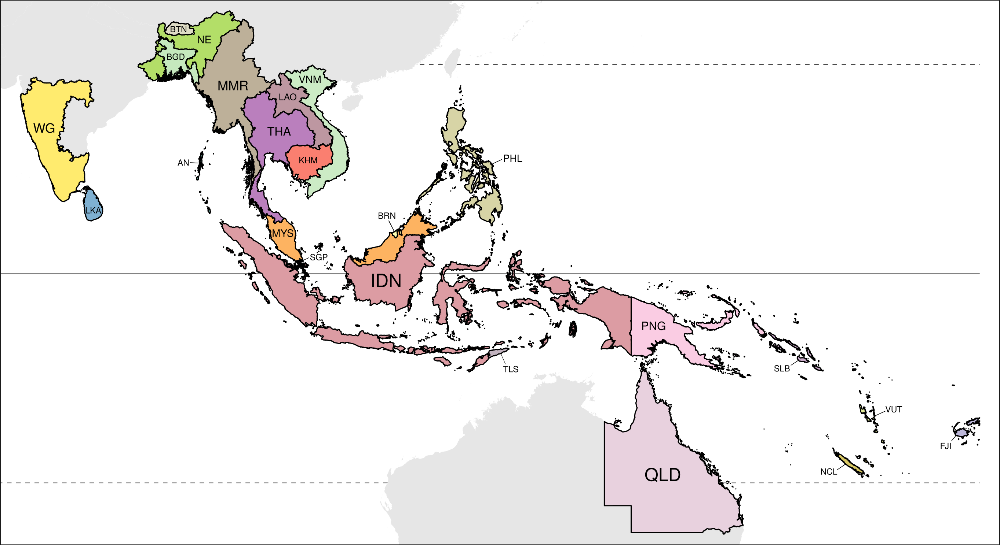
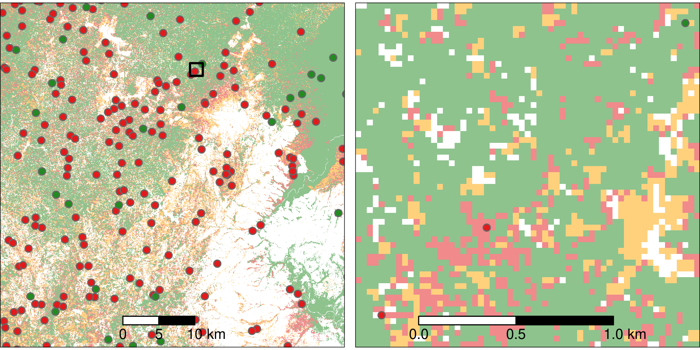
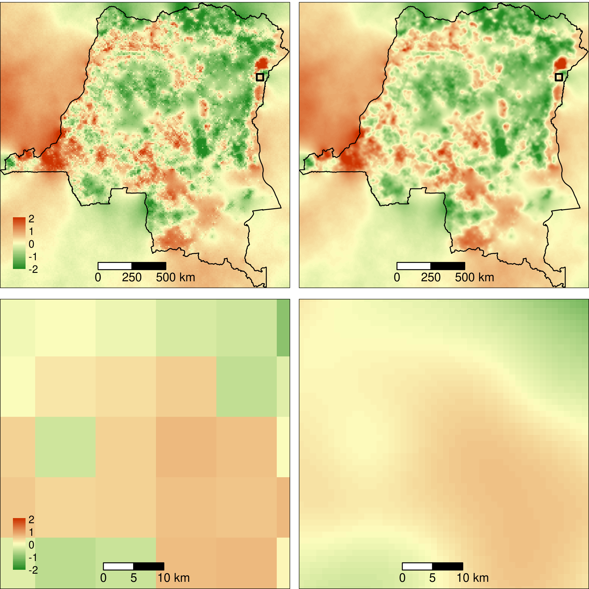
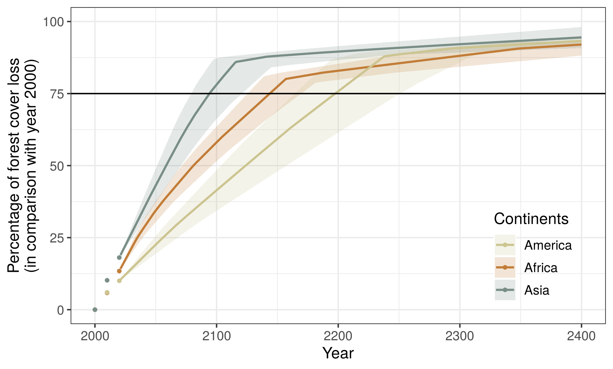

# Figures

<!--------------------------------------------->
<!-- Study-areas -->
<!--------------------------------------------->

## Study-areas in the three continents

(ref:cap-study-areas) **Study-areas in the three continents: America, Africa, and Asia**. America included 64 study-areas (39 countries), Africa included 32 study areas (32 countries), and Asia included 23 study-areas (21 countries). Each country was identified by one unique three-letter code following the ISO 3166-1 standard (eg. MDG for Madagascar or GUF for French Guyana). In America, Brazil was divided in 26 study areas corresponding to the 26 Brazilian states. Each Brazilian state was defined by one unique two-letter code (eg. AM for Amazonas). For India, three study areas were considered: the Whestern Ghats (WG), the North-East India (NE), and the Andaman and Nicobar Islands (AN). For Australia, we only considered the Queensland (QLD) state as a study-area. In the three figures, each study-area is identified by one unique code and a set of polygons with the same color. The horizontal lines on each figure indicate the position of the Equator (plain line) and the two tropics (Cancer at the North and Capricorn at the South, dashed lines).

```{r study-areas-am, out.width="\\textwidth", fig.cap=NULL}
knitr::include_graphics("figures/study_areas_America.png")
```

```{r study-areas-af, out.width="\\textwidth", fig.cap=NULL}
knitr::include_graphics("figures/study_areas_Africa.png")
```

```{r study-areas, out.width="\\textwidth", fig.cap="(ref:cap-study-areas)"}

```

<!--------------------------------------------->
<!-- Historical forest cover change map -->
<!--------------------------------------------->

## Historical forest cover change map

(ref:cap-fcc-maps) **Historical forest cover change map**. Forest cover change map on the period 2000--2010--2020 for the Democratic Republic of the Congo in central Africa. \textcolor{orange}{orange}: 2000--2010 deforestation, \textcolor{red}{red}: 2010--2020 deforestation, \textcolor{darkgreen}{green}: forest cover in 2020. Forest cover change map was derived from the forest cover change annual product by @Vancutsem2020. Original resolution of the forest cover change map is 30 m. The inset at the bottom left shows a zoom of the map for an area at the North-East of the country which is close to the city of Beni and the Virunga national park. An interactive global forest cover change map is available at <https://forestatrisk.cirad.fr/tropics>.

```{r fcc-maps, out.width="\\textwidth", fig.cap="(ref:cap-fcc-maps)"}
knitr::include_graphics("figures/fcc123_COD.png")
```

<!--------------------------------------------->
<!-- Spatial explanatory variables -->
<!--------------------------------------------->

## Spatial explanatory variables used for spatial modelling of deforestation

(ref:cap-var) **Spatial explanatory variables**. Spatial explanatory variables for the Democratic Republic of the Congo in central Africa. Elevation (in m) and slope (in degree) at 90 m resolution were obtained from the SRTM Digital Elevation Database v4.1 (<http://srtm.csi.cgiar.org/>). Distances (in m) to nearest road, town and river at 150 m resolution were computed from the road, town and river network obtained from OpenStreetMap (OSM) (<https://www.openstreetmap.org/>). Roads include "motorway", "trunk", "primary", "secondary" and "tertiary" roads from OSM. Towns include "city", "town" and "village"  categories from OSM. Rivers include "river" and "canal" categories from OSM. Protected areas were obtained from the World Database on Protected Areas (<https://www.protectedplanet.net>, @WDPA2020). Data included protected areas of all IUCN categories (from Ia to VI) and of all types defined at the national level (e.g. National Parks, Reserves). Two additional spatial explanatory variables (distance to forest edge and distance to past deforestation) were obtained from the historical forest cover change map (Fig. \@ref(fig:fcc-maps)).

```{r var, out.width="\\textwidth", fig.cap="(ref:cap-var)"}

```

<!--------------------------------------------->
<!-- Data sampling -->
<!--------------------------------------------->

## Data sampling

(ref:cap-sampling) **Data sampling for spatial modelling of the deforestation**. Map on the left corresponds to the top left inset in Fig. \@ref(fig:fcc-maps) representing a zoom of the forest cover change map on the period 2000--2010--2020 for an area at the North-East of the Democratic Republic of the Congo. Map on the right presents an inner zoom showing the delimitation of the 30 m forest pixels with three sample points. We used a stratified balanced sampling between (i) forest pixels in 2010 which have been deforested on the period 2010--2020 ("deforested" pixels in \textcolor{red}{red}), and (ii) forest pixels in 2010 which have not been deforested on that period of time and which represent the remaining forest in 2020 ("non-deforested" pixels in \textcolor{darkgreen}{green}). Forest pixels in each category were sampled randomly.

```{r sampling, out.width="\\textwidth", fig.cap="(ref:cap-sampling)"}

```

<!--------------------------------------------->
<!-- Grid for spatial random effects -->
<!--------------------------------------------->

## Grid for spatial random effects

(ref:cap-grid) **Grid used to compute the spatial random effects**. _Main figure_: $10 \times 10$ km grid covering the Democratic Republic of the Congo (DRC). The grid over DRC includes 45,154 $10 \times 10$ km cells (214 cells on the x axis by 211 cells on the y axis). The background map shows the historical forest cover change on the periods 2000--2010--2020 (see Fig. \@ref(fig:fcc-maps)). _Top inset_: Zoom for an area at the North-East of the country (black square) showing specific grid cells. One grid cell can include several sample points (see Fig. \@ref(fig:sampling)). _Bottom inset_: One random effect $\rho_j$ is estimated for each grid cell $j$. Spatial autocorrelation is taken into account through an intrinsic CAR process: the value of the random effect for one cell depends on the values of the random effects $\rho_{j^{\prime}}$ for the eight neighbouring cells $j^{\prime}$ (see Eq. \@ref(eq:icar)).

```{r grid, out.width="\\textwidth", fig.cap="(ref:cap-grid)"}
knitr::include_graphics("figures/grid_COD.png")
```

<!--------------------------------------------->
<!-- Spatial random effects -->
<!--------------------------------------------->

## Estimated spatial random effects

(ref:cap-rho) **Estimated spatial random effects**. _Left_: Estimated spatial random effects at 10 km resolution for the Democratic Republic of the Congo (DRC). _Right_: Interpolated spatial random effects at 1 km resolution. A bicubic interpolation method was used. _Bottom_: Zoom for an area at the North-East of the country (black square) which is close to the city of Beni and the Virunga national park. Due to the structure of the intrinsic CAR model (see Eq. \@ref(eq:icar)), spatial random effects are also estimated for cells without sampled points. This includes cells for which there was no forest cover on the period 2000--2010--2020, and also cells outside country's borders.

```{r rho, out.width="\\textwidth", fig.cap="(ref:cap-rho)"}

```

<!--------------------------------------------->
<!-- Spatial probability of deforestation -->
<!--------------------------------------------->

## Relative spatial probability of deforestation

(ref:cap-prob) **Predicted relative spatial probability of deforestation**. _Main figure_: Map of the spatial probability of deforestation computed for each forest pixel in 2020 for the Democratic Republic of the Congo. On the map, we clearly see the effect of the distance to nearest town, road, and river, and the effect of the distance to forest edge on the spatial probability of deforestation. Also, we clearly see the importance of the spatial random effects in structuring the spatial variability of the deforestation probability. For example, the area at the North of the zoom (black square) shows very high deforestation probabilities (in black). This area is politically unstable and is home to a large number of militias who survive at the expense of the forest. _Inset_: Zoom of the map for an area at the North-East of the country which is close to the city of Beni and the Virunga national park.

```{r prob, out.width="\\textwidth", fig.cap="(ref:cap-prob)"}
knitr::include_graphics("figures/prob_COD.png")
```

<!--------------------------------------------->
<!-- Projected forest cover change -->
<!--------------------------------------------->

## Projected forest cover change

(ref:cap-proj) **Projected forest cover change**. _Main figures_: Maps of the projected forest cover change (left: 2020--2050, right: 2020--2100) for the Democratic Republic of the Congo (DRC). \textcolor{red}{red}: projected deforestation, \textcolor{darkgreen}{green}: remaining forest cover. Besides the loss of forest cover, we show a progressive fragmentation of the forest in the future, with an increasing number of forest patchs of smaller size in DRC. _Insets_: Zoom of the map for an area at the North-East of the country (black square) which is close to the city of Beni and the Virunga national park. Interactive global maps of the projected forest cover change for years 2050 and 2100 are available at <https://forestatrisk.cirad.fr/tropics>.

```{r proj, out.width="\\textwidth", fig.cap="(ref:cap-proj)"}
knitr::include_graphics("figures/fcc2050_2100_COD.png")
```

<!--------------------------------------------->
<!-- Percentage of forest cover loss -->
<!--------------------------------------------->

## Percentage of forest cover loss

(ref:cap-perc-loss) **Projected percentage of forest cover loss per continent**. Points represent the observed percentage of forest cover loss (in comparison with the year 2000) for years 2000 (0%), 2010, and 2020, for the three continents: America, Africa, and Asia. Lines represent the projected percentage of forest cover loss (in comparison with the year 2000) from 2020 to 2400 per continent. For the deforestation projections, we assumed no diffusion of the deforestation between countries (see section \@ref(forecast) in Methods). When large countries with high annual deforested areas (Brazil for America, DRC for Africa, and Indonesia for Asia) have nor more forest (in 2242, 2160, and 2122, respectively, Table \@ref(tab:fcc-proj)), deforestation at the continent scale is rapidly decreasing. The horizontal black line indicates a loss of 75% of the forest cover in comparison with the year 2000. Under a "business-as-usual" scenario, this should happen in 2099, 2145, and 2201 for Asia, Africa, and America, respectively (see Table \@ref(tab:fcc-proj-reg)). 

```{r perc-loss, out.width="\\textwidth", fig.cap="(ref:cap-perc-loss)"}

```

<!--------------------------------------------->
<!-- Aboveground biomass map -->
<!--------------------------------------------->

## Aboveground biomass map

(ref:cap-agb) **Aboveground biomass map**. _Main figure_: Aboveground biomass (AGB in Mg/ha) map for the Democratic Republic of Congo (DRC) at 1 km resolution produced by @Avitabile2016. This map is a combination of two pantropical aboveground biomass maps by @Saatchi2011 and @Baccini2012. While the RMSE of the fused map by @Avitabile2016 is still substancial (87--98 Mg/ha), the fused map achieved a lower RMSE (a decrease of 5–74%) and bias (a decrease of 90–153%) than the two input maps for all continents. The fusion map is representative of the aboveground biomass for the years 2000--2010. _Inset_: Zoom of the map for an area at the North-East of the country which is close to the city of Beni and the Virunga national park.

```{r agb, out.width="\\textwidth", fig.cap="(ref:cap-agb)"}

```

<!-------------------------------------------------------->
<!-- Carbon emissions associated to projected deforestation
<!-------------------------------------------------------->

```{r}
f <- here("Analysis", dataset, "results", "C_trend.csv")
C_trend <- read.table(f, header=TRUE, sep=",")
C_10_20 <- round(C_trend$T10_20[C_trend$area_cont=="All continents"], 2)
C_all <- C_trend[C_trend$area_cont=="All continents",-c(1)]
C_max <- round(max(C_all), 2)
```

## Carbon emissions associated to future deforestation

(ref:cap-c-em) **Carbon emissions associated to projected deforestation**. This figure displays the future change in annual carbon emissions (Pg/yr) associated to projected deforestation of moist tropical forests. Mean annual carbon emissions were computed for ten-year intervals from 2010--2020 to 2090--2100. Points represent the observed mean annual carbon emissions (based on historical deforestation maps) for the period 2010--2020, for the three continents (America, Africa, and Asia), and for all continents together. Lines represent the projected mean annual carbon emissions (based on projected forest cover change maps) from 2020--2030 to 2090--2100 per continent, and for all continents together. Annual carbon emissions at the pantropical scale are predicted to increase from `r C_10_20` in 2010--2020 up to `r C_max` Pg/yr in 2080--2090.  

```{r -c-em, out.width="\\textwidth", fig.cap="(ref:cap-c-em)"}
knitr::include_graphics("figures/C_trend.png")
```

\newpage