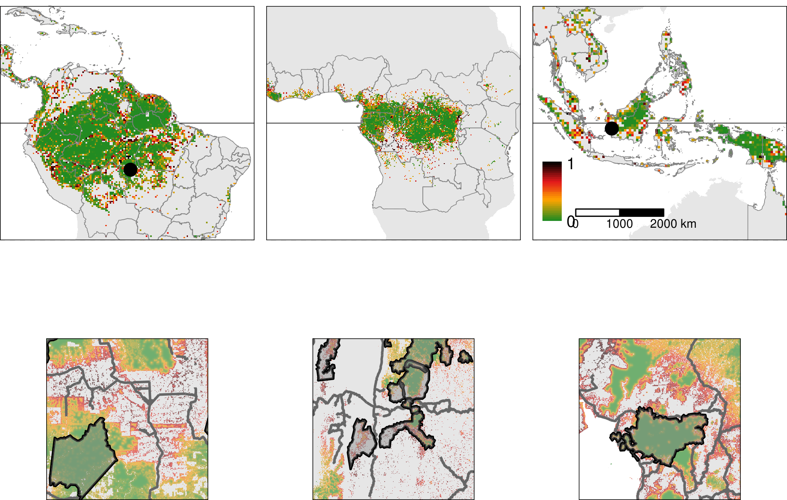

[](https://www.gnu.org/licenses/gpl-3.0.html)
[](https://doi.org/10.18167/DVN1/7N2BTU)
[](https://forestatrisk.cirad.fr)
[](https://ecology.ghislainv.fr/forestatrisk)

This repository includes the code used to produce the results of the following scientific article:

<a href="https://orcid.org/0000-0002-1685-4997"></a>
**Vieilledent G.,**
<a href="https://orcid.org/0000-0003-3851-8588"></a>
**C. Vancutsem, and**
**F. Achard.**
2022.
Forest refuge areas and carbon emissions from tropical deforestation in the 21^st^ century. _preprint_.
doi: [10.1101/XXXX.XX.XX.XXXXXX](https://doi.org/10.1101/XXXX.XX.XX.XXXXXX).
[](https://forestatrisk.cirad.fr/article/Vieilledent2022-preprint.pdf)
Supplementary Information [](https://forestatrisk.cirad.fr/article/Vieilledent2022-preprint-SI.pdf)



Figure 2: **Pantropical map of the risk of deforestation.**

## Minimal reproducible example using the `forestatrisk` Python package

This [notebook](https://ecology.ghislainv.fr/forestatrisk/notebooks/far_tropics.html) provides a minimal and reproducible example presenting the general approach we followed to model and forecast deforestation in each of the 119 study areas (representing 92 countries) considered in the above article. We use the Guadeloupe archipelago as a case study. The notebook is available at the [website](https://ecology.ghislainv.fr/forestatrisk) associated with the `forestatrisk` Python package. This package has been specifically developed for this study and provides functions to model and forecast deforestation in the tropics.

## Steps followed to produce the results of the study

We present below the R and Python scripts which have been used to produce the results of the study, from the datasets preparation to the writing of the manuscript.

### 1. Preparing datasets

```bash
## Derive past forest cover change maps from the annual product 
## of Vancutsem et al. 2021 using Google Earth Engine.
python Tropics/forest_gee_jrc.py

## Download raw data from on-line databases (GADM, SRTM, WDPA, OSM), and Google Drive.
python Tropics/download_raw_data.py

## Compute explanatory variables (elevation, slope, distances, etc.).
python Tropics/compute_variables.py
```

### 2. Estimating deforestation intensity

```bash
## Compute deforestation rates and uncertainty
Rscript Intensity/intensity.R

## Estimate contagious deforestation between states of Brazil
python Intensity/brazil_fcc_jrc.py
```

### 3. Spatial modeling and forecasting

```bash
## Model and forecast
python Tropics/model_and_forecast.py
```

### 4. Post-processing and writing

```bash
## Combine rasters to obtain continental maps
python Maps/combine.py

## Synthesize results
Rscript Analysis/synthesis.R

## Plot main maps
Rscript Maps/main_maps.R
Rscript Maps/main_maps_prob.R

## Plot supplementary maps
Rscript Maps/supp_maps.R

## Compile documents
Rscript Manuscript/zzz_knitr_compile/compile_book.R
```

## Website accompanying the article

A website at <https://forestatrisk.cirad.fr> is accompanying the article cited above. The website includes the following resources:

### Interactive map

We release interactive pantropical maps of the past forest cover change (2000--2010--2020), of the risk of deforestation (2020), and of the projected forest cover in 2050 and 2100:

- [Map of the tropics](https://forestatrisk.cirad.fr/maps.html)

### Download

Rasters of results from this study can be downloaded as Cloud Optimized GeoTIFFs ([COG](https://www.cogeo.org/)):

- [Rasters](https://forestatrisk.cirad.fr/rasters.html)
- [COG tutorial](https://forestatrisk.cirad.fr/notebooks/cog.html)

### Supplementary data

- [Data S1](https://forestatrisk.cirad.fr/data-s.html): Uncertainty around projected forest cover.
- [Data S2](https://forestatrisk.cirad.fr/data-s.html): Uncertainty around projected carbon emissions.

### `forestatrisk` Python package

Results from this study have been obtained with the `forestatrisk` Python package:

- [Package website](https://ecology.ghislainv.fr/forestatrisk/) (with full documentation)
- [Tutorials](https://ecology.ghislainv.fr/forestatrisk/articles.html)

<span style="display: block; height: 15px;"></span>
<p>Copyright &copy; 2021 <a href="https://www.cirad.fr/en/">Cirad</a>, <a href="https://ec.europa.eu/jrc/en">EC JRC</a>. All rights reserved.</p>

<a href="https://www.cirad.fr/en/"></a>
<a href="https://www.cirad.fr/en/"></a>
<a href="https://amap.cirad.fr"></a>
<a href="https://ec.europa.eu/jrc/en"></a>

<!-- End of file -->
