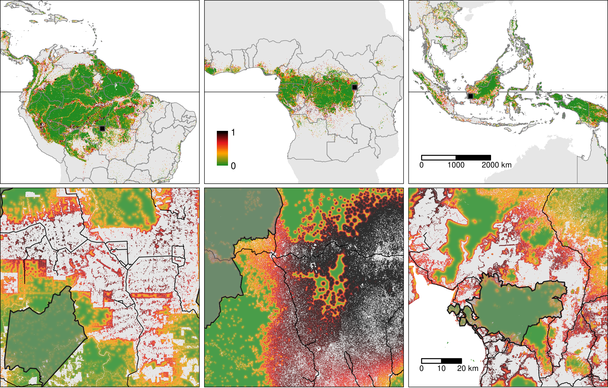

forestatrisk-tropics
================

[](https://forestatrisk.cirad.fr)
[](https://www.gnu.org/licenses/gpl-3.0.html)
[](http://dx.doi.org/10.18167/DVN1/FKEEEP)

This repository includes the code used to produce the results of the
following scientific article:

<a href="https://orcid.org/0000-0002-1685-4997"></a>
**Vieilledent G.,**
<a href="https://orcid.org/0000-0003-3851-8588"></a>
**C. Vancutsem,** **F. Achard.** Spatial forecasting of forest cover
change in the humid tropics over the 21<sup>st</sup> century. in prep.



Figure 2: **Pantropical map of the risk of deforestation.**

## Reproducibility of the results

### Computing historical deforestation rates and uncertainty

``` bash
Rscript Intensity/intensity.R
```

### Geoprocessing and modelling

1\. Derive historical forest cover change map from the annual product of
Vancutsem et al. 2021 using Google Earth Engine.

``` bash
python Tropics/forest_gee_jrc.py
```

2\. Download raw data from on-line databases (GADM, SRTM, WDPA, OSM),
and Google Drive.

``` bash
python Tropics/download_raw_data.py
```

3\. Compute explanatory variables (elevation, slope, distances, etc.).

``` bash
python Tropics/compute_variables.py
```

4\. Model and forecast

``` bash
python Tropics/model_and_forecast.py
```

5\. Combine rasters to obtain continental maps

``` bash
python Maps/combine.py
```

### R for post-processing and writing

1\. Plot main maps

``` bash
Rscript Maps/main_maps.R
```

2\. Plot supplementary maps

``` bash
Rscript Maps/supp_maps.R
```

3\. Synthesize results

``` bash
Rscript Analysis/synthesis.R
```

4\. Compile documents

``` bash
Rscript Manuscript/zzz_knitr_compile/compile_book.R
```

<span style="display: block; height: 15px;"></span>
<p>
Copyright © 2021 <a href="https://www.cirad.fr/en/">Cirad</a>,
<a href="https://ec.europa.eu/jrc/en">EC JRC</a>. All rights reserved.
</p>

<a href="https://www.cirad.fr/en/"></a>
<a href="https://www.cirad.fr/en/"></a>
<a href="https://amap.cirad.fr"></a>
<a href="https://ec.europa.eu/jrc/en"></a>

<!-- End of file -->
